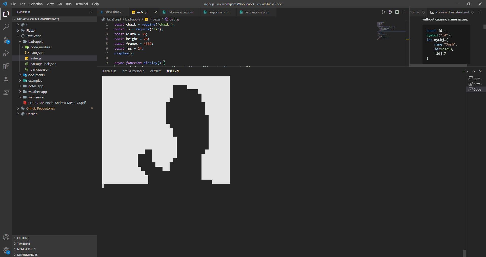

# bad-apple.js
[![LinkedIn][linkedin-shield]][linkedin-url]

<!-- PROJECT LOGO -->
 

  

  <h3 align="center">Display Bad Apple video on Node terminal!</h3>

## About The Project
bad-apple.js is a project that reads the data sheet given in the folder.
## Video Link :
[![product-screenshot]](https://youtu.be/4WxbU1j7pCs)
                    
                    
<!-- CONTACT -->
## Contact
Project Link: [https://github.com/umutsevdi1/bad-apple.js](https://github.com/umutsevdi1/bad-apple.js)

<!-- MARKDOWN LINKS & IMAGES -->
<!-- https://www.markdownguide.org/basic-syntax/#reference-style-links -->
[linkedin-shield]: https://img.shields.io/badge/-LinkedIn-black.svg?style=for-the-badge&logo=linkedin&colorB=555
[linkedin-url]: https://www.linkedin.com/in/umut-sevdi/
[product-screenshot]: BadApple_First_Frame.png
